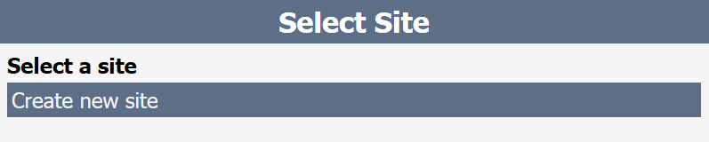
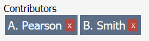
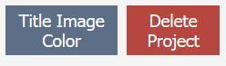
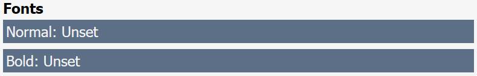

# Installing
Installation files can be found [here](https://github.com/FreeMasen/SiteBuilder/releases)
## MacOS
1. Download the file `SB.MacOS.zip`
1. Double click this downloaded file to un-compress it
1. Inside should be a file called `SB.dmg`
1. Double click this file to mount it
1. Open the new image called `SiteBuilder`
1. Drag the single file included into your Applications folder
1. Control click the file that is now in your Applications folder
1. Select Open from this menu
1. If prompted again select open, this will add SiteBuilder to your security exceptions

## Windows
1. Download the file `site-builder.Windows.zip`
1. Double click this downloaded file to view its contents
1. If you would like to you can extract this file to a permanent location
1. Double click site-builder.exe to run the program

# Basic Usage
This application will allow you to create a portfolio site with [this overall structure](https://freemasen.github.io/SiteBuilder)

When the application starts, you should be brought to a list of sites you have created. If this is the first time you have run the application you will only see 1 entry for "Create new site" clicking on this will, you guessed it, create a new site.

This will prompt you to select a source folder for your site. Once you select a folder, you will be brought to the Site screen.

## Site
On the site screen you will have the ability to adjust your site, it also acts as a starting point for editing the content.

First, you will see an input box to update your site's title, this is what will appear in the left header position.

Next you will see 3 buttons
- Refresh
  - This will refresh the information here based one the actual files in your `source` folder.
  - [This can be useful for bulk adding/deleting images for a project](#bulk-images)
- Generate
  - This will generate your site into the Output Directory
  - note: this will validate that your site is at least minimally complete
- Add Project
  - This does what it says, adds a project to your site

After these buttons, you will see two input boxes
- Input Directory
  - This should be filled in already with the value you selected when you created the site.
- Output Directory
  - At first this will be blank but once set it should remember your choice

Clicking on the input box should bring up a dialog box for your to select your folder.

After that you will see a list of pages for your site. This will always include an About page, so at first this will be the only item in the list. Once you have added a project to your site a new page will be listed below About.

Clicking on About will open up an editor for your about page.

## About
The about page will include 2 items for you to edit, the first is Image

By clicking on this input box you will be asked to select a file. The program will allow you to select what ever file you want but for the webpage to display it correctly it would need to be a image.

Next is the About Content input box which is much larger. This input box will allow you to enter the content you would like to appear next to your image on the About page for your site. This input is designed to work with the [markdown](https://github.com/adam-p/markdown-here/wiki/Markdown-Cheatsheet) format if you needed to embed an HTML snippet from somewhere else or you wanted to apply custom formatting.

Below this input box you will see a Cancel and Save button, these will either revert or save your changes to the About Content, images are always updated immediately.

Clicking on either button will bring you back to the Site screen.
## Projects
When you click the 'Add Project' button, you will see a new entry in the Pages list. This will always be added with the title 'project-0' where the number will be your new total number of pages. Now that you have a project in your pages list, you can click on that to take you to the project editor.

This will have a much larger number of items for you to edit than the about editor. First we have the site's Title, Subtitle and list of contributors. 

These items will control the first three lines of your project page. The contributors line is optional, so if the project doesn't have any contributors it will not add any empty space. To add a new contributor, enter the name in the input box and click the + button.

Clicking on the x button of a contributor block will remove them from the project.

Next there are two buttons
- Title Image Color/B&W
  - This allows you to let the application know if the first image in your list of images is color or not.
  - Black and white photos on the main page get a colored overlay on hover instead of being re-saturated
- Delete Project
  - This will delete your project from the site
  - This removes any files/folders created in your `source` folder

Next we have the content editor, this input box will allow you to enter the description of each project. This box, like the box on our About page will accept [markdown](https://github.com/adam-p/markdown-here/wiki/Markdown-Cheatsheet) for embedded html snippets or custom formatting.

So far, all of the items displayed will not be finalized changes until you click the save button. Clicking save or cancel will bring you back to the Site screen

note: Adding and removing images will happen immediately.

Next to that is the Images editor. This will allow you to add, remove and/or re-order the images you want to associate with a project.

The order that the images appear here will be the order they appear on your site. The first image in this list will be the image that appears on your main page for this project. To move an image up/down in the list simply select it and use the up/down arrow buttons. To add a new image, click the Add button and you will be prompted to select a file to include in your project

# Fonts
Each site is required to have a normal and bold font file provided. To do this simply click the Normal or Bold entry in the fonts list. This will allow you to select a file.

# Accent Color
You will be able to choose a color you would like to act as your site's accent color. This color will be the overlay for B&W images on the index page, as well as the color that the header and contact form buttons turn when moused over. To choose a color, you can either look up the hex code from a site like [color-hex](http://www.color-hex.com/) or you can use the sliders to mix your own color.

- R - This will be the amount of red in your color (0-255)
- G - This will be the amount of green in your color (0-255)
- B - This will be the amount of Blue in your color (0-255)
- A - This is how transparent your color is (0.0-1.0)
  - 0.0 is fully transparent
  - 1.0 is fully opaque

These changes will be saved when you click the Save button

# Advanced

## Bulk Images
For bulk editing project images, you may want to first dump your image files into the project's folder. To do this simply create the folder and then copy/paste the files into the newly created folder's img folder. Once you do that you will want to use the Refresh button from the site screen to update the application. 

## Delete a Site
To delete a site, you will need to open the `source` folder for that site and delete the `.site-builder` file.

## Include a Previously Edited Site
If you have a folder with a `.site-builder` file but it isn't listed in your sites list, simply choose this folder as the source folder for a new site and the application will added to the list for the future.

## Uninstall entirely
While the application should be fully portable, meaning you can just delete the `SiteBuilder.app` or `SiteBuilder.exe` file, there is some information that is cached by the application to remember stuff between uses. To remove this information you would need to delete the `.site-builder-cache` file from your `HOME` folder which is `/User/[username]` for MacOS and `C:\Users\[username]` for Windows. In addition to this global cache, there is also a cache local to each site you have added, to delete this you would delete the `.site-builder` file from the site's source folder.